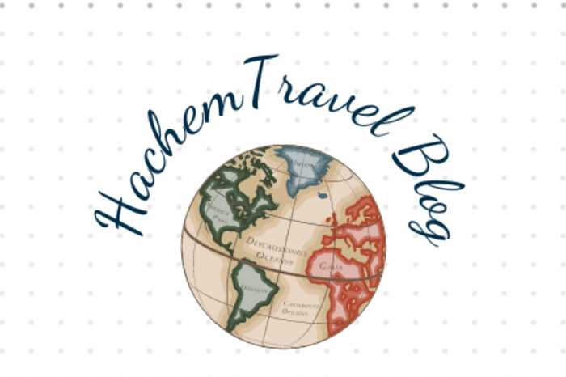

<!-- PROJECT LOGO -->
<br />
<p align="center">
    
</p>


# ⚠️gatsby-contentful Avengers Blog

[Next.js](https://nextjs.org/) [Contentful](https://www.contentful.com) Travel Blog inspired by my travel journals. It is about telling stories, tips, learning about cultures and dipping into adventures with me.


## Requirements

To use this project you have to have a Contentful account. If you don't have one yet you can register at [www.contentful.com/sign-up](https://www.contentful.com/sign-up/).

## Getting started

Install [Yarn](https://yarnpkg.com/en/docs/install) (if you haven't already).

### Get the source code and install dependencies.

```
$ git clone https://github.com/Hachem-B/NextJS-Travel-Blog-sourcing-from-Contentful.git
$ yarn install
```


## Getting started
```
npm install
npm run dev
```
# or
```
yarn install
yarn dev

```

The blog should be up and running on http://localhost:3000  !

